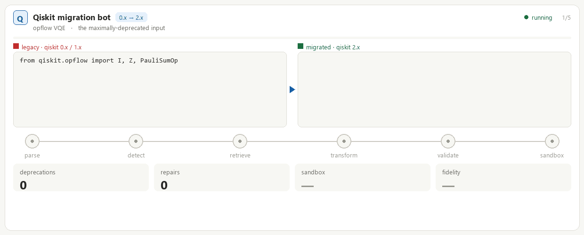
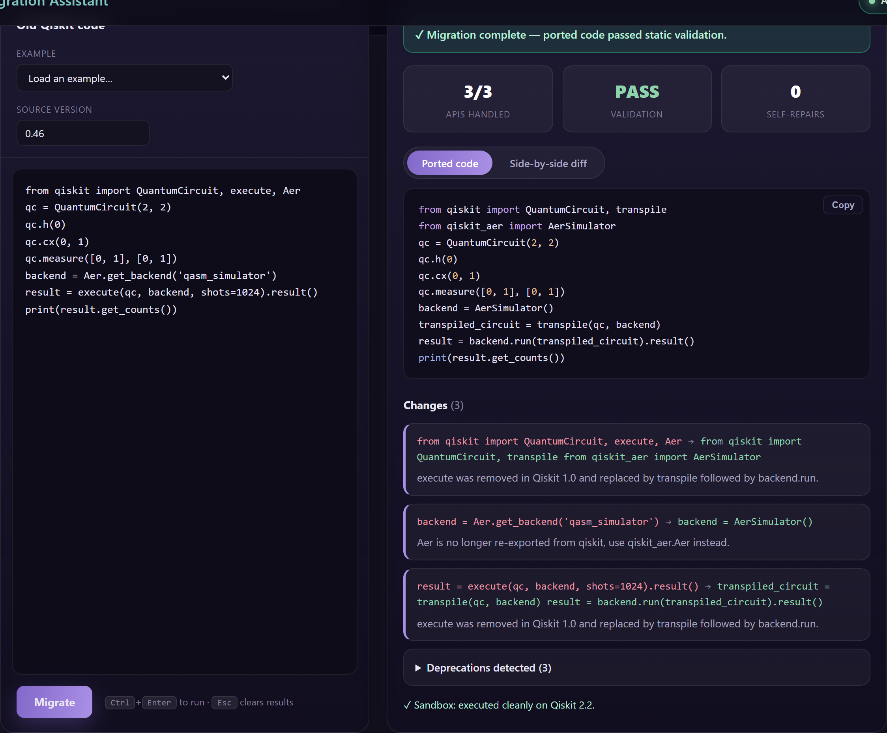

# Qiskit Migration Assistant

> Paste old Qiskit code → get it ported to the latest release (2.x), with a cited,
> per-change rationale — grounded in the official deprecation record and **validated by
> actually executing the result** against the target Qiskit.

[](https://github.com/Ziadt160/qiskit-migration-assistant/actions/workflows/ci.yml)
[](https://www.python.org/downloads/)
[](https://www.ibm.com/quantum/qiskit)
[](https://github.com/astral-sh/ruff)
[](LICENSE)
[](https://huggingface.co/spaces/quZiad/qiskit-migration-assistant)



> _Five real cases on loop — `qiskit.opflow` VQE and `qiskit.aqua` QSVM (0.x → 2.x), plus V1→V2
> primitives, fake-provider/BackendV2, and ansatz classes→functions (1.x → 2.x). Each is detected,
> rewritten, run in a sandbox, and verified._
>
> **▶ [Try the live demo](https://huggingface.co/spaces/quZiad/qiskit-migration-assistant)** —
> paste old Qiskit code and see what's deprecated plus its verified 2.x replacement (free, no keys).



> _Old code in, runnable Qiskit 2.x out — every change cited, validation **PASS**, and
> "executed cleanly on Qiskit 2.2." More scenarios in [`docs/screenshots/`](docs/screenshots);
> regenerate them with [`scripts/capture_screenshots.py`](scripts/capture_screenshots.py)._

A production-grade **RAG (retrieval-augmented generation) system** that upgrades Qiskit
code across breaking releases. Most "fix my code" tools hallucinate plausible-but-wrong
APIs. This one is grounded in the real deprecation/release-note record, statically checked
for leaked deprecated symbols, and then **run in a sandbox against `qiskit==2.x`** with a
self-repair loop — so what you get back is code that actually imports and runs.

**It runs fully local and free** (GPU embeddings + a local Ollama model), with optional
hosted providers (Anthropic, Gemini, Cohere) if you'd rather not run models yourself.

> 📓 **Maintainers / running it for real?** [`docs/HANDOFF.md`](docs/HANDOFF.md) is the
> complete runbook — every run mode, the full config reference, operational gotchas, and
> current state.

---

## Why it's interesting

- **Grounded, not guessed.** A curated, authoritative deprecation table (plus a release-note
  parser) decides *what* changed; retrieval pulls the *evidence*; the LLM only does the
  mechanical rewrite — with citations.
- **Verified by execution.** Migrated code is run inside a locked-down Docker sandbox
  (`--read-only`, `--network=none`, tmpfs). If it raises, the error is fed back for up to
  `MAX_REPAIRS` self-repair attempts.
- **Pluggable everywhere.** Embeddings, reranker, LLM, and sandbox backend are each swappable
  via one env var — local-and-free or fully hosted, your call.
- **Honestly evaluated.** A golden eval set gates the project on detection recall, reference
  cleanliness, and real executability — not vibes.

### Results

The golden set has **29 cases** spanning every curated deprecation. The headline metrics
are **deterministic and reproducible by anyone** — no API keys, no model — which is what
makes the benchmark verifiable:

| Metric (29 cases) | Score | Reproduce with |
|---|---|---|
| Deprecation-detection recall | **1.00** (32/32) | `python -m qiskit_migration.eval.run_eval --seed-only` |
| Reference cleanliness | **1.00** (29/29) | `python -m qiskit_migration.eval.run_eval --seed-only` |
| Reference code executes on real Qiskit 2.2.3 | **25/29** | `... --executable --sandbox-backend docker` |

> The 4 non-executing cases are **environmental, not migration defects**: `ibmq-removed`
> (needs `qiskit-ibm-runtime` + an IBM Quantum account + network), `ignis-tomography` (the
> removed `qiskit-ignis` package), `tools-visualization` (matplotlib, omitted from the
> air-gapped sandbox), and `tools-parallel-map` (a `parallel_map` pickling quirk). The sandbox
> is air-gapped by design, so the self-repair loop retries then reports the limitation rather
> than faking success.

### End-to-end with the LLM

The end-to-end tier runs the *whole* pipeline — retrieval → LLM rewrite → sandbox → self-repair —
on the same 29-case golden set. With **gpt-4.1**:

| End-to-end metric (29 cases) | Result |
|---|---|
| Migrated cleanly (passed static validation) | **22 / 29** |
| Migrated **and executed clean on real Qiskit 2.x** | **20 / 29** |
| Execution rate among the cases it migrated | **91%** (20 / 22) |

The deep restructures pass — the full **`qiskit.opflow` VQE → primitives**, the **`qiskit.aqua`
VQE → ecosystem** move, and **`execute()` → primitives**. Where the model slips (a few removed
gate-methods such as `mct` / `fredkin`), the validators and sandbox **flag it as a failure**
instead of returning broken-looking-clean code — which is the entire point. Reproduce with
`python -m qiskit_migration.eval.run_eval --e2e --sandbox-backend docker`.

> The generator is swappable via one env var (`LLM_PROVIDER`) — local Ollama, Anthropic,
> Gemini, or any OpenAI-compatible endpoint — so you pick the quality/cost trade-off.

---

## Example

```bash
python -m qiskit_migration.migration.cli --code "qc.bind_parameters({theta: 0.5})"
```

The assistant detects that `QuantumCircuit.bind_parameters` was removed, retrieves the
relevant release note, and returns the rewrite plus a rationale:

```text
- qc.bind_parameters({theta: 0.5})
+ qc.assign_parameters({theta: 0.5})

rationale: `bind_parameters` was deprecated and removed in favor of `assign_parameters`,
which supersedes it (Qiskit release notes). Behavior is equivalent for this call.
coverage: 1/1 handled · validation: PASS
```

Point it at a whole project and it shows a unified diff per changed file (dry-run by default):

```bash
python -m qiskit_migration.migration.cli --path ./my_project --recursive            # preview diffs
python -m qiskit_migration.migration.cli --path ./my_project --recursive --apply    # write changes
```

It cheaply pre-filters offline to only the files that actually use a deprecated API before
spending any LLM calls, and skips junk dirs (`.venv`, `__pycache__`, `build`, …).

---

## How it works

```
old code
  │
  ├─▶ AST symbol extraction (symbols.py)
  ├─▶ deprecation lookup ── authoritative table (deprecations.py, SQLite)
  ├─▶ hybrid retrieval (retrieval.py) ── Pinecone vector search + Cohere rerank
  ├─▶ LLM structured transform (generate.py) ── Ollama | Claude | Gemini → LLMTransformOutput
  ├─▶ static validation (validate_output.py) ── parses + no leaked deprecated APIs
  └─▶ sandbox execution + self-repair (sandbox.py) ── run vs qiskit==target, feed errors back
```

| Stage | Default | Swappable via |
|---|---|---|
| Embeddings | local `BAAI/bge-large-en-v1.5` (1024-d, GPU) | `EMBEDDING_PROVIDER` (`local`, `cohere`) |
| Vector store | managed **Pinecone** (cosine, dim 1024) | — |
| Reranking | Cohere (query-time) | `RERANK_ENABLED` |
| LLM (generation) | local **Ollama** `qwen2.5-coder` | `LLM_PROVIDER` (`ollama`, `anthropic`, `gemini`) |
| Sandbox | none (set to `docker` to verify) | `SANDBOX_BACKEND` (`none`, `local`, `docker`) |

Deprecation knowledge = a curated, authoritative seed (`qiskit_migration/migration/data/known_deprecations.json`)
plus a heuristic release-note parser, compiled into a SQLite table. The seed outranks parsed
records, so curated facts win over noisier parses.

Serving is a **FastAPI** app (`/migrate`, `/jobs/{id}`, `/healthz`, `/readyz`, `/metrics`)
backed by an **RQ** worker (jobs in SQLite/Postgres), plus a **Streamlit** UI.

---

## Quick start

### Prerequisites

- **Python 3.11+** (the package targets 3.11; production Docker images pin 3.12).
- **Pinecone** account + index (`PINECONE_API_KEY`) — required for retrieval.
- For the fully-free path: **[Ollama](https://ollama.com)** and a GPU (or set
  `EMBEDDING_DEVICE=cpu`).
- For executable verification: **Docker** (the sandbox needs a `qiskit`-installed image).

### Install

```bash
git clone https://github.com/Ziadt160/qiskit-migration-assistant.git
cd qiskit-migration-assistant

python -m venv .venv
. .venv/Scripts/activate        # Linux/macOS: . .venv/bin/activate

pip install -e ".[dev,local]"   # add ,postgres for the prod DB driver
cp .env.example .env            # then fill in keys (see Configuration)
```

> CUDA torch isn't on PyPI — for GPU embeddings install it from the PyTorch index, e.g.
> `pip install torch --index-url https://download.pytorch.org/whl/cu126`.

### The fully-local, free setup (no API keys for the LLM)

```bash
ollama pull qwen2.5-coder:7b
```

In `.env`:

```ini
LLM_PROVIDER=ollama
EMBEDDING_PROVIDER=local
```

Now embeddings (local GPU) and generation (Ollama) are both unlimited and free; only
Pinecone retrieval talks to the network.

### Build the knowledge base & index

```bash
make build-store    # compile the deprecation knowledge base from the docs corpus (offline)
make ingest         # embed + upsert the corpus into Pinecone (one-time; re-run on model switch)
```

> The corpus lives in `documentation/` — a separate Qiskit-docs checkout, gitignored for
> its size. It's needed to build the store and to ingest, **not** at request time.
> `make ingest` **wipes the index first** (vectors from different embedding models live in
> incompatible spaces), so re-ingest whenever you change `EMBEDDING_MODEL`.

---

## Usage

### CLI

```bash
# Offline: just report deprecations in a snippet (no network, no LLM)
python -m qiskit_migration.migration.cli --offline --file old_code.py

# Full migration of one snippet or file (needs Pinecone + an LLM provider)
python -m qiskit_migration.migration.cli --file old_code.py
python -m qiskit_migration.migration.cli --code "from qiskit import execute" --json

# Migrate a file or whole directory, diff per changed file
python -m qiskit_migration.migration.cli --path ./my_project --recursive           # dry-run
python -m qiskit_migration.migration.cli --path ./my_project --recursive --apply   # write changes
```

### REST API

```bash
make serve     # uvicorn on :8000   (add a worker with `make worker`, or set QUEUE_EAGER=true)

# Enqueue a migration
curl -s -X POST localhost:8000/migrate \
  -H 'content-type: application/json' \
  -d '{"code": "from qiskit import execute", "source_version": "0.45"}'
# → {"job_id": "…", "status": "queued"}

# Poll for the structured result
curl -s localhost:8000/jobs/<job_id>
# → {"id": "…", "status": "succeeded", "result": { …MigrationResult… }, "error": null}
```

Other endpoints: `GET /healthz`, `GET /readyz`, `GET /metrics` (Prometheus). The `/migrate`
endpoint is per-client rate-limited.

> No Redis handy? Run the API with `QUEUE_EAGER=true` and jobs execute inline — no worker
> needed.

### Web UI

The API serves a polished single-page web app — just start the API and open it:

```bash
make serve                  # uvicorn on :8000
# open http://localhost:8000/ui/   (the root path / redirects here)
```

A custom front end (no framework, no CDN — served straight from `qiskit_migration/app/web/`): hero,
example snippets, a code editor, live status pill, an animated progress stepper, and a
results view with metrics, syntax-highlighted **Ported code** and a **side-by-side diff**,
a per-change rationale with citations, detected deprecations, and the sandbox verdict.
Soft, modern dark theme; brand assets generated with Canva.

A **Streamlit** client is also available as an alternative:

```bash
streamlit run qiskit_migration/app/chatbot.py        # set MIGRATION_API_URL if the API isn't on :8000
```

---

## Configuration

All settings are env-driven (`qiskit_migration/config.py`, loaded from `.env`). The most important ones:

| Variable | Purpose | Notes |
|---|---|---|
| `PINECONE_API_KEY` / `PINECONE_INDEX` | Vector store | Required |
| `EMBEDDING_PROVIDER` | `local` \| `cohere` | `local` = BGE on GPU |
| `EMBEDDING_DEVICE` | `cuda` / `cpu` | blank = auto |
| `LLM_PROVIDER` | `ollama` \| `anthropic` \| `gemini` | `ollama` is free/local |
| `RERANK_ENABLED` | query-time Cohere rerank | needs `COHERE_API_KEY` |
| `SANDBOX_BACKEND` | `none` \| `local` \| `docker` | `docker` verifies execution |
| `QISKIT_TARGET_VERSION` | migration target | default `2.2` |
| `MAX_REPAIRS` | self-repair attempts | default `2` |

See [`.env.example`](.env.example) for the full annotated list (model names, Redis/DB URLs,
LangSmith tracing, etc.).

**Provider notes:** Ollama is the free, unlimited local choice and scored best on the eval.
Anthropic Claude needs a paid **Developer Platform** key (a Claude Max subscription does
**not** grant API access). Gemini's free tier is tight. Cohere here is the trial key, used
only for low-volume query-time reranking.

---

## Evaluation

```bash
python -m qiskit_migration.eval.run_eval --seed-only      # offline gate (detection recall + ref cleanliness) — CI gate
python -m qiskit_migration.eval.run_eval --retrieval      # + live retrieval recall
python -m qiskit_migration.eval.run_eval --e2e            # + full pipeline through the LLM
python -m qiskit_migration.eval.run_eval --executable --sandbox-backend docker   # run gold refs vs real Qiskit
```

The offline gate (`make eval`) fails the build if deprecation-detection recall drops below
0.9 or any gold reference fails static validation.

---

## Project structure

```
qiskit_migration/
├── config.py              # all settings (get_settings), .env-driven
├── embeddings.py          # pluggable embedders + rerankers
├── ingestion/             # load docs → version-aware metadata → chunk → embed → upsert
├── retrieval/             # thin Pinecone vector-search primitive (metadata-filtered)
├── migration/
│   ├── symbols.py         # AST extraction of Qiskit API symbols
│   ├── deprecations.py    # curated seed + release-note parser + SQLite store
│   ├── retrieval.py       # hybrid (symbol-targeted + semantic) retrieval + rerank
│   ├── validate_input.py  # input guardrails
│   ├── validate_output.py # static output validation (no leaked deprecated APIs)
│   ├── sandbox.py         # LocalSubprocess + Docker sandboxes (read-only, no-network)
│   ├── transform.py       # orchestrator: input→symbols→deps→retrieve→generate→validate→sandbox→repair
│   ├── report.py          # iter_python_files, unified_diff, compute_coverage
│   ├── models.py          # Pydantic result/coverage/validation/sandbox models
│   └── cli.py             # CLI entrypoint
├── generation/generate.py # Ollama | Anthropic | Gemini generators → structured output
├── api/main.py            # FastAPI app (factory: create_app)
├── worker/                # RQ worker + job runner + queue (eager fallback)
├── db/db.py               # SQLAlchemy JobStore (SQLite/Postgres)
├── cache.py               # result cache (Redis/no-op)
├── observability.py       # Prometheus metrics
├── app/chatbot.py         # Streamlit UI
├── eval/                  # golden set + metrics + gate runner
└── tests/                 # hermetic unit suite (externals mocked)

scripts/                   # run_ingestion.py, manual_search.py
Dockerfile.{api,worker,ui,sandbox}, docker-compose.yml, Makefile
```

---

## Development

```bash
make test        # pytest -q — hermetic unit suite, all external services mocked
make lint        # ruff check + format --check (CI gates on these)
make fmt         # ruff format + autofix
make typecheck   # mypy qiskit_migration
make eval        # offline eval gate
```

CI (`.github/workflows/ci.yml`): ruff → mypy (non-blocking) → pytest → eval gate → Docker build.

---

## Docker & deployment

```bash
docker compose up -d --build      # api, worker, redis, postgres, ui
```

A single-VM Docker Compose topology. Images pin Python 3.12 (heavy compiled wheels like
`qiskit-aer` lag on newer Pythons). The executable sandbox uses a dedicated
`Dockerfile.sandbox` (Python 3.12 + `qiskit==2.x` + `qiskit-aer`).

---

## Recently shipped

- **Behavioral-equivalence checking** — runs the original on old Qiskit vs the migrated code
  on the target and compares each circuit by **statevector fidelity `|⟨ψ_old|ψ_new⟩|`**
  (`equivalence.py`); proves a migration preserves *behavior*, not just that it imports.
- **Runtime-grounded detection** — the target sandbox's own `DeprecationWarning`s are parsed
  and fed back into the repair loop as authoritative deprecations, so coverage stays current
  with the target version, not a frozen snapshot (`runtime_deprecations.py`, `--runtime-deps`).
- **Provenance-aware matching** — deprecations match by fully-qualified *import identity*, not
  bare name, eliminating the `qiskit_aer.Aer` vs removed `qiskit.Aer` false-positive class.
- **OpenAI-compatible generator** — one driver for Groq / OpenRouter / Cerebras / GitHub Models
  (several with a free tier); `LLM_PROVIDER=openai`. Use a powerful frontier model for free.
- **Version coverage 0.2x → 2.1** — Aqua-era application modules (chemistry/finance/optimization/
  ml) through the newest 2.1 ansatz-function deprecations (TwoLocal → `n_local`, …).
- **Automated cross-package harvest** — `harvest.py --mode cross-package` enumerates a legacy
  package's API surface in a throwaway container (e.g. `qiskit-aqua==0.9.0` on py3.9) and
  name-matches every symbol to an index of the ecosystem on the target image, promoting the
  *moved-same-name* symbols as sandbox-verified records. Griffe only diffs one package across
  versions, so it's blind to cross-package moves (`qiskit.aqua` → `qiskit-algorithms/…`); this
  closes that gap. Renames (QSVM → QSVC) aren't name-matchable and stay curated.
- **No-op safety** — already-modern code is returned verbatim; the LLM never rewrites what the
  authoritative table says isn't deprecated.

## Honest limits

- **Retrieval needs Pinecone** today (a fresh clone runs `--offline` deprecation analysis with
  zero accounts; full migration retrieval needs a Pinecone key). A local vector backend is the
  top roadmap item.
- **The generator is the ceiling on the hardest rewrites.** A 7B local model handles mechanical
  changes but not deep restructures (e.g. opflow → primitives); a frontier model (free via
  GitHub Models / OpenRouter) does — and the sandbox + validators catch any miss rather than
  returning broken-looking-clean code.
- **Executable validation needs Docker**; behavioral-equivalence currently runs the *old* side
  on a 0.46 image, so genuinely pre-0.46 code reports "undetermined" rather than a false pass.

## Roadmap

- **Local vector store** (FAISS / sqlite-vec) + a shippable prebuilt index — make retrieval
  runnable with no external accounts.
- Extend deprecation coverage at the tails: a `2.0→2.2` runtime-warning harvest, the deep
  pre-0.46 surface, and tiered legacy sandbox images for source-side equivalence beyond 0.46.
- Jupyter notebook (`.ipynb`) support; source-version auto-detection.
- Generalize the engine to a second library (e.g. Pandas 1→2).
- Adoption channels: VS Code extension, pre-commit hook, GitHub Action.

> **On multiple versions:** the design is **direct-to-latest with version-keyed knowledge**
> (the approach Amazon Q's Java upgrader uses), not multi-hop LLM rewriting — and the runtime
> oracle keeps target-side coverage complete by construction.

---

## License

Released under the [MIT License](LICENSE).

## Acknowledgements

Built on [Qiskit](https://www.ibm.com/quantum/qiskit), the official Qiskit documentation
corpus, [Pinecone](https://www.pinecone.io/), [Ollama](https://ollama.com),
[sentence-transformers](https://www.sbert.net/) / `BAAI/bge-large-en-v1.5`, and
[FastAPI](https://fastapi.tiangolo.com/).
